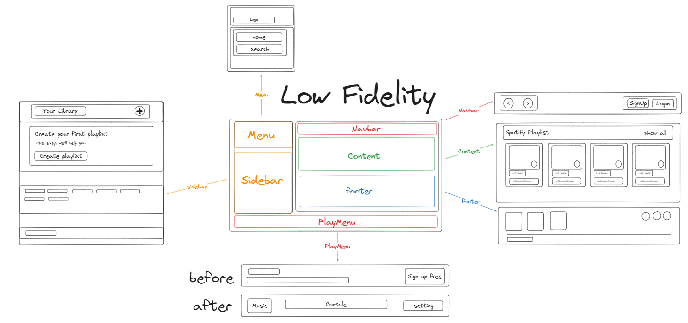
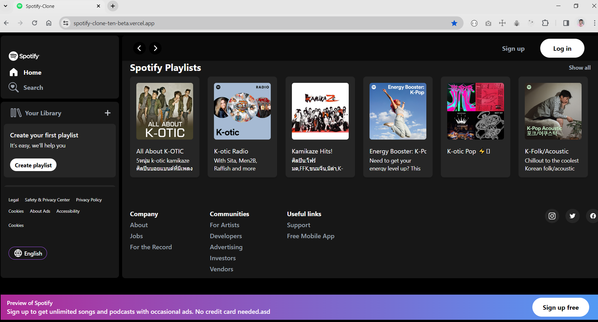
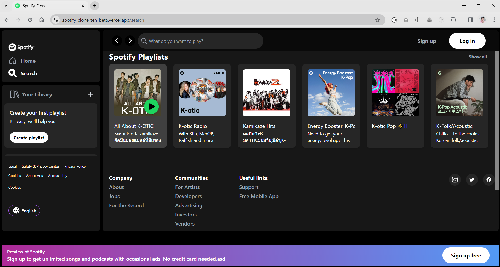
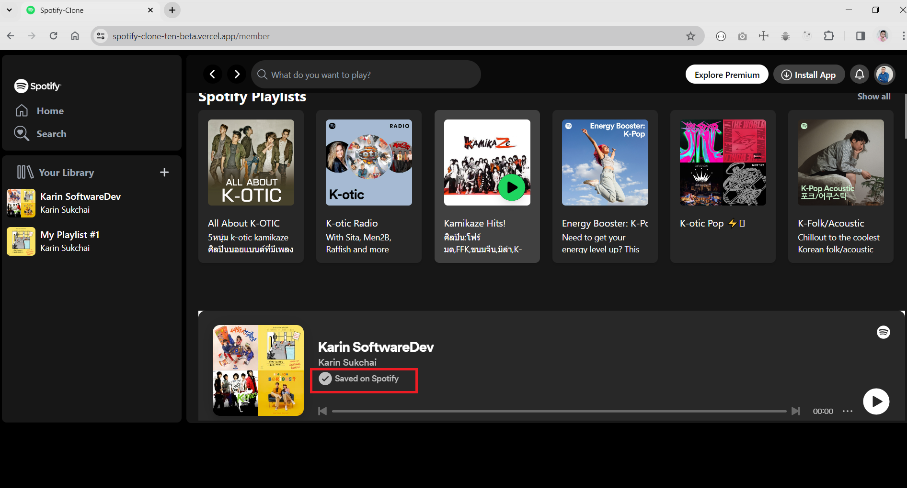
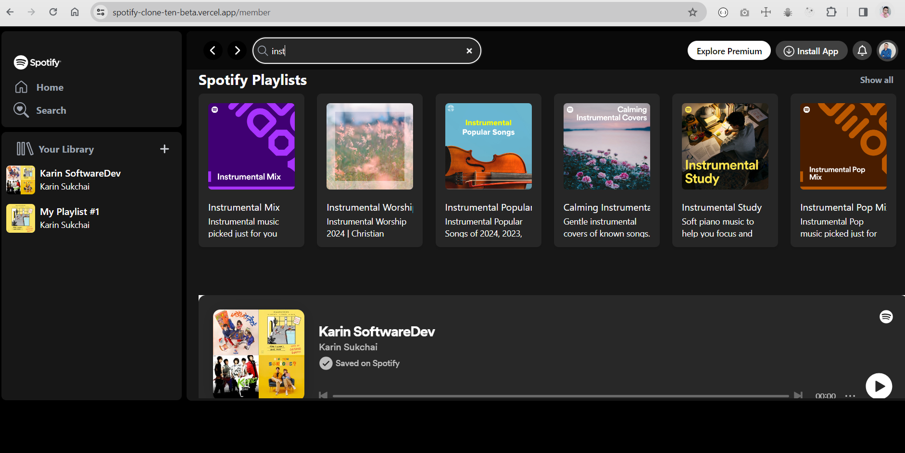
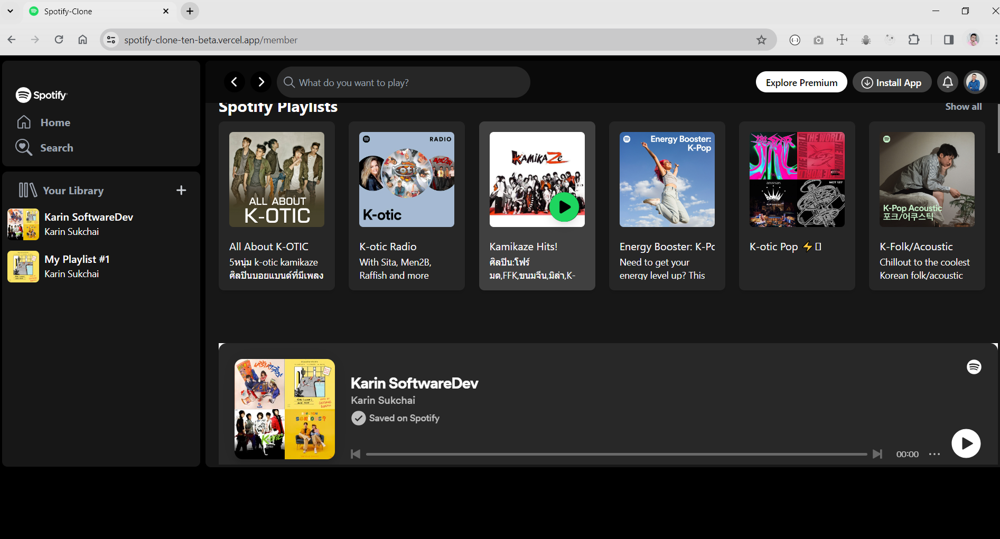
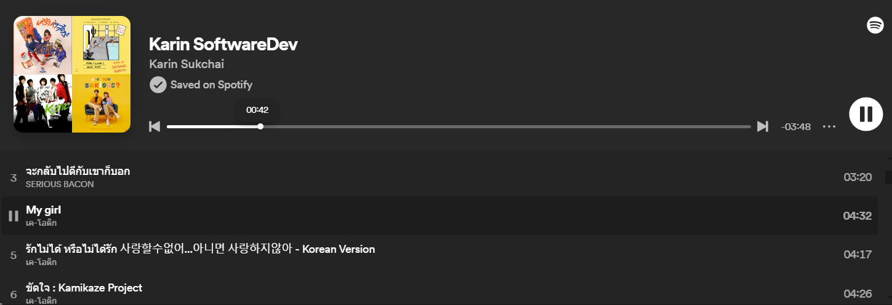

# React + Vite

This template provides a minimal setup to get React working in Vite with HMR and some ESLint rules.

Currently, two official plugins are available:

- [@vitejs/plugin-react](https://github.com/vitejs/vite-plugin-react/blob/main/packages/plugin-react/README.md) uses [Babel](https://babeljs.io/) for Fast Refresh
- [@vitejs/plugin-react-swc](https://github.com/vitejs/vite-plugin-react-swc) uses [SWC](https://swc.rs/) for Fast Refresh

# Spotify Clone Project

This Clone project is created by Karin Sukchai before the first release
I writed the following by low fidelity

and then let start to the code when finished my low fidelity

### Live Demo

this is a live demo of the My spotify clone project : https://spotify-clone-ten-beta.vercel.app/

# requirements

If you need to taste your own live demo you must send me an email here : karinsukchai.offial@gmail.com  
with the subject "Spotify Clone Testing Request." and the body is your full name.

Because if you don't have permission to access to a web browser I think your playlist is not allowed to
my Spotify Clone Project.

I'm Waiting for you to submit your request to Spotify Clone Testing Request.

# Access Token for Spotify Clone

- Token just have 5 minutes to access. if permission time out you will login to Spotify clone Project Again.

# You can do what with this project?

- Guest

  on the first page guest user will only search the playlist and
  get the limit of 6 playlist and up to 20 limited playlist items to show on the first page when you click show all.
  if Guest need to listening to the playlist music it have only way to listen,
  Guest must login to Spotify Clone Project first. on button login in the top of navbar

- Member

  when you login the project will get to member path of the Spotify Clone Project
  and this is you can do in my projects

  1.  you can add the playlist to you spotify id but it's not a public playlist if you save it
      to your own playlist you can see it in the only spotify application or https://open.spotify.com/

2.  you can search all of the playlist in spotify by clicking search on the top of navbar
    it's automatically search you must not click Submit or Enter again because it's realtime search
    when you keyup or when words in the search input is changed it's will search automatically

3.  you can see your playlist or the playlist that you're clicking and enjoy your choosing it

4.  you only just play a song in your playlist or choosing playlist only in the Player bar.

# Thank you for watching my repository. ❤ ❤ ❤
